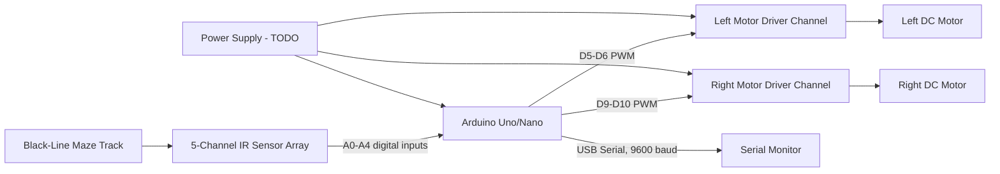
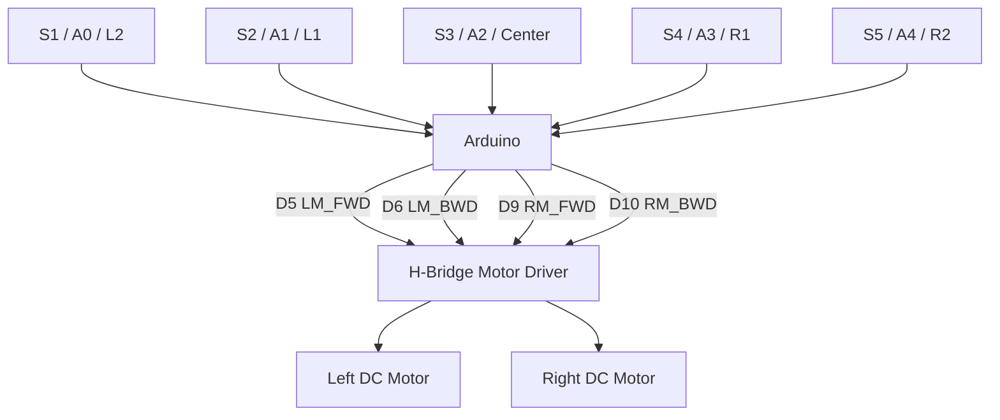
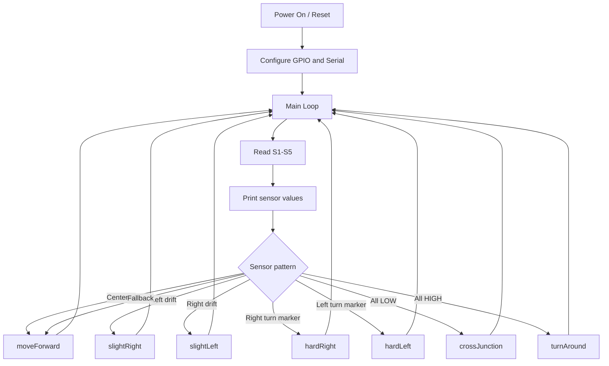
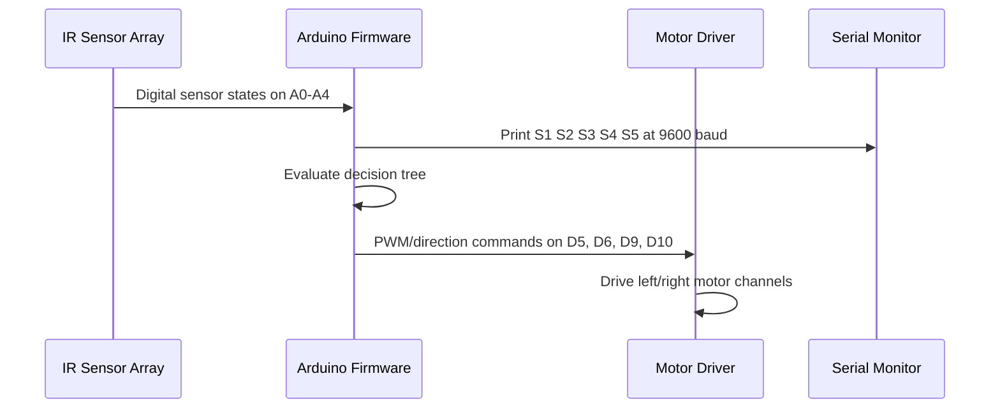

# Autonomous Maze-Solving Robot using IR Sensors and Arduino

A professional embedded-systems repository for an Arduino-based autonomous maze-solving robot that uses a five-channel IR sensor array and a dual H-bridge motor driver to follow line paths, detect maze events, and command two DC motors.

> **Information policy:** This repository documents only the details currently available in the provided project. Unknown hardware measurements, PCB details, publication data, validation results, and author/contact information are marked as TODO instead of being assumed.

## Project Overview

The robot reads five IR sensors arranged from left to right, evaluates the current sensor pattern, and selects a motion primitive such as forward motion, slight correction, hard turn, cross-junction handling, or turnaround. The Arduino sketch also streams sensor states to the Serial Monitor for debugging.

## Features

- Five-sensor line detection using IR inputs `S1`-`S5` on Arduino pins A0-A4.
- Differential-drive motor control through `LM_FWD`, `LM_BWD`, `RM_FWD`, and `RM_BWD` pins.
- PWM-based motor speed commands with Arduino `analogWrite()`.
- Junction, turn, and dead-end handling through deterministic sensor-pattern logic.
- Serial debug output at 9600 baud for real-time sensor-state visibility.

## Applications

- Embedded firmware portfolio demonstration.
- Educational line-following and maze-solving robotics.
- Sensor-based mobile-robot control experiments.
- Hardware-software integration practice with Arduino, IR sensors, DC motors, and H-bridge drivers.

## System Architecture



See [`docs/system_architecture.md`](docs/system_architecture.md) for additional architecture, data-flow, and state-machine diagrams.

## Hardware Components

| Subsystem | Component |
|---|---|
| Controller | Arduino Uno/Nano |
| Motor driver | L293D or L298N dual H-bridge motor driver |
| Motors | Two DC motors: left and right |
| Sensors | Five IR sensors connected to A0-A4 |
| Mechanical | Chassis and wheels |
| Power | TODO: document battery, regulator, voltage, and current rating |

## Software Stack

- Arduino framework.
- C/C++ Arduino sketch.
- Arduino IDE or Arduino CLI for build/upload.
- Serial Monitor at 9600 baud for debugging.

## Repository Structure

```text
.
├── firmware/
│   └── maze_solver/
│       └── maze_solver.ino
├── docs/
│   ├── firmware.md
│   ├── hardware.md
│   └── system_architecture.md
├── hardware/
│   ├── pcb/
│   │   └── README.md
│   └── schematics/
│       └── README.md
├── images/
│   └── README.md
├── simulation/
│   └── README.md
├── .gitignore
├── LICENSE
└── README.md
```

## Hardware Block Diagram



## Firmware Architecture



## Communication Flow



## Power Architecture

TODO: Add the confirmed power architecture. At minimum, document the motor supply, Arduino logic supply, sensor supply, common ground, regulator module, battery rating, and protection components.

## Setup Instructions

1. Install the Arduino IDE or Arduino CLI.
2. Connect the Arduino Uno/Nano to the host computer over USB.
3. Wire the motor driver, motors, and five IR sensors according to the pin map in [`docs/hardware.md`](docs/hardware.md).
4. Open `firmware/maze_solver/maze_solver.ino` in the Arduino IDE.
5. Select the correct Arduino board and serial port.

## How to Build

Using Arduino IDE:

1. Open `firmware/maze_solver/maze_solver.ino`.
2. Select the target board, such as Arduino Uno or Arduino Nano.
3. Click **Verify**.

Using Arduino CLI, if installed:

```bash
arduino-cli compile --fqbn arduino:avr:uno firmware/maze_solver
```

## How to Run

1. Upload the sketch to the Arduino board.
2. Place the robot on a black-line maze track.
3. Open the Serial Monitor at 9600 baud to observe sensor states.
4. Power the motor driver and confirm that Arduino, sensors, and motor driver share the required ground reference.

## Testing

TODO: Add measured validation results. Suggested checklist:

- Verify the sketch compiles for the selected Arduino board.
- Confirm each IR sensor toggles on black versus white surfaces.
- Confirm both motors rotate in expected directions for each motion primitive.
- Validate maze behavior on a known track.
- Capture serial logs for representative path conditions.

## Future Improvements

- TODO: Add calibrated sensor thresholds if analog sensing is introduced.
- TODO: Add non-blocking turn timing to reduce control-loop latency.
- TODO: Add documented maze-solving policy if path optimization is implemented.
- TODO: Add schematic, PCB files, hardware photos, and validation artifacts.

## Project Status

Prototype firmware and documentation are present. Hardware schematics, PCB files, simulation artifacts, validation logs, publication data, author name, and contact details are TODO placeholders until provided.

## Known Limitations

- The firmware uses fixed motor PWM values and blocking delays.
- The firmware uses digital sensor reads only; no ADC-based calibration pipeline is implemented.
- Power-supply specifications are not yet documented.
- PCB design information is not yet provided.
- Quantitative performance metrics are not yet provided.

## Citation

TODO: Add paper, report, DOI, conference, journal, or publication link if this project has been published.

## License

This project is released under the MIT License. See [`LICENSE`](LICENSE).

## Author

TODO: Add author name.

## Contact

TODO: Add email, LinkedIn, portfolio, or GitHub profile.
