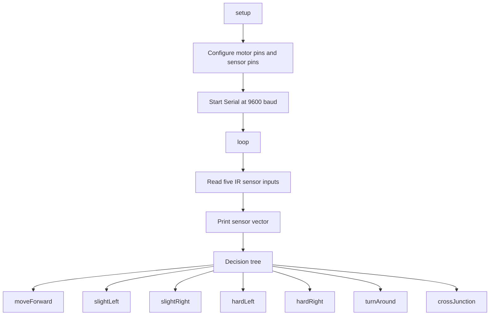

# Firmware Documentation

## Software Stack

- Arduino framework.
- C/C++ `.ino` sketch.
- Serial monitor for debug visibility at 9600 baud.

## Firmware Architecture

## Sensor Interface

The five IR channels are read as digital inputs from A0-A4. The firmware assumes `LOW` corresponds to line detection based on the provided decision logic.

## PWM Generation

Motor speed and direction commands are generated with Arduino `analogWrite()` on D5, D6, D9, and D10. The implementation uses fixed PWM command values of 150 or 200 depending on the maneuver.

## Peripheral Usage

| Peripheral | Usage |
|---|---|
| GPIO | IR sensor digital inputs and H-bridge control pins |
| PWM timers | Motor speed control through `analogWrite()` |
| UART-over-USB serial | Sensor-state debug output |

## Interrupts

No custom interrupt service routines are implemented in the provided firmware.

## Register-Level Design

The provided firmware uses Arduino APIs rather than direct register-level configuration. TODO: Add register-level notes if the implementation is later ported to direct AVR register access.

## Testing Methodology

TODO: Add test logs and validation artifacts. Suggested non-fabricated checklist:

- Compile the Arduino sketch for the selected board.
- Confirm each sensor channel changes state on black and white surfaces.
- Confirm left and right motors respond to forward and reverse commands.
- Verify serial monitor output at 9600 baud.
- Validate maze behavior on a known test track.
