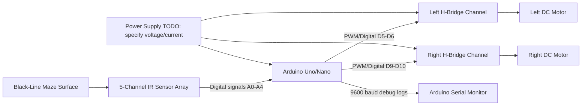
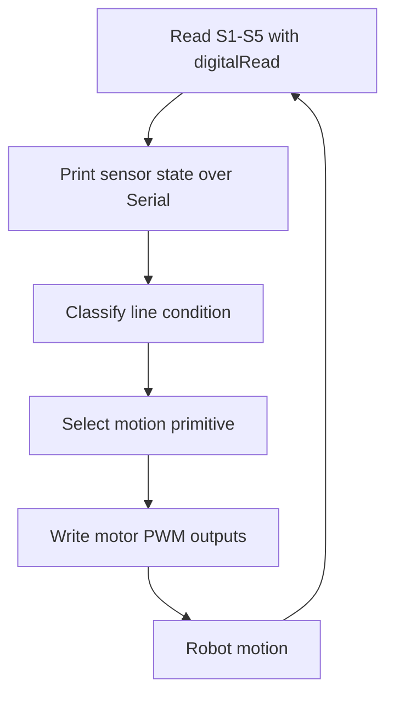
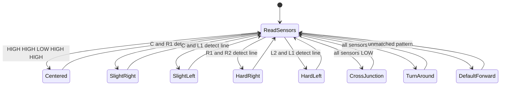

# System Architecture

## Overview

This project implements an Arduino-based autonomous maze-solving and line-following robot using a five-channel IR sensor array and a dual H-bridge motor driver. The firmware continuously samples the IR sensors, classifies the current line or maze condition, and commands the left and right DC motors through PWM-capable Arduino pins.

## Hardware Block Diagram

## Data Flow

## Control Flow

The control loop is implemented in `loop()` and runs continuously without an explicit scheduler. Decision priority is encoded by the order of conditional checks in the firmware.

1. Read five IR sensor channels.
2. Emit sensor readings to the serial monitor for debugging.
3. Match the sensor pattern against known cases: centered line, slight corrections, hard turns, cross junction, dead end, or default forward motion.
4. Update motor-driver outputs using `analogWrite()` and short blocking delays for hard turns, turn-around behavior, and cross-junction traversal.

## State Machine

## Communication Protocols

- USB serial debug output at 9600 baud.
- TODO: Document any external communication protocol if added later.

## Timing, Interrupts, and Timers

- The provided firmware does not configure custom interrupts.
- The provided firmware uses Arduino `analogWrite()`, which relies on board timer peripherals for PWM generation.
- The provided firmware uses blocking `delay()` calls during hard turns, turnaround, and cross-junction traversal.

## ADC Pipeline

The current firmware reads the IR sensor pins with `digitalRead()`. Although the sensors are connected to Arduino analog-capable pins A0-A4, the provided implementation treats each channel as a digital thresholded input. No explicit ADC pipeline is implemented.
